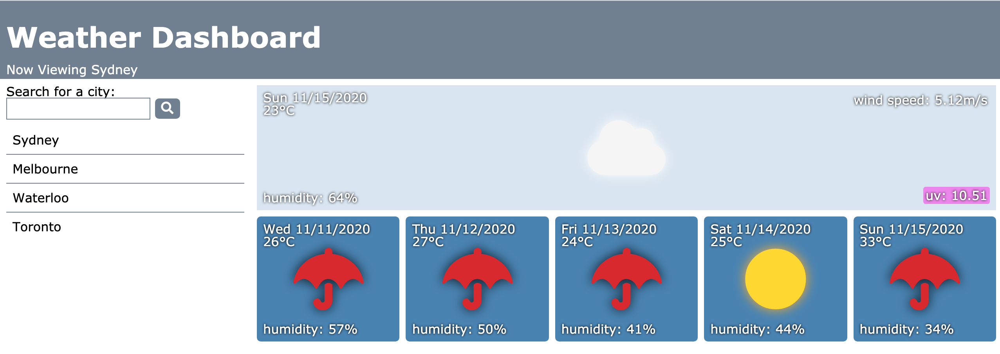

# Weather Dashboard
A simple app that gives a five day forecast with more detailed current weather.

## Table of Contents
1. [ Description ](#desc)
2. [ Visuals ](#visuals)
3. [ Deployed Webpage ](#deployed)
4. [ Support ](#support)
5. [ Next Steps ](#next_steps)
6. [ Authors and Acknowledgement ](#acknowledge)
7. [ License ](#license)

## 1. Description
This app gives weather information over 6 days (current and 5 day forecast) for various cities.

### Note:
I used font-awesome icons instead of the ones that come with the API because I just wanted to be different.

### Summary of Functionality

* You can view weather information for the current day in a popular city of your choosing. This information includes the UV index, current temperature, wind speed, humidity, and weahter conditions.
* You can view a weather forecast for the same city. This information includes current temperature, humidity, and weather conditions.
* The background color for the current day adjusts depending on the time of day in that city.

## 2. Visuals
Screenshot of the webpage.

## 3. Deployed Webpage
[The deployed site](https://tasha876.github.io/Weather-Dashboard/), hosted by GitHub Pages.

## 4. Support
Should you find an issue with this webpage, please create a [new issue](https://github.com/Tasha876/Weather-Dashboard/issues/new/choose) on my GitHub repository.

## 5. Next steps
Several features could be added, some of them are as follows:
- better UI
- use of an API that gives less preference to US cities (the current one shows Melbourne in the US instead of Australia etc.)

## 6. Authors and Acknowledgement
This site was created by Natasha Fray using [JavaScript](https://www.javascript.com/), *most of* the styling and the idea of the website was provided by the [UofT SCS Coding Bootcamp](https://bootcamp.learn.utoronto.ca/).

## 7. License
This project is covered by the [MIT](LICENSE) license.

